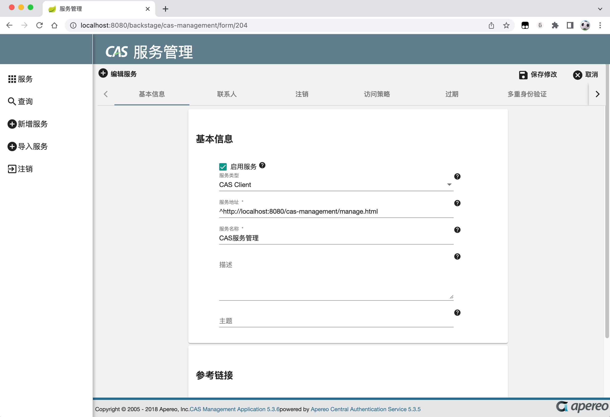

# CAS 服务管理项目（5.3.x 中文版）

## 项目介绍

- 本项目是针对 [原项目](https://github.com/apereo/cas-management) 的中文翻译版本
- 仅翻译了`5.3.x`分支的部分内容



## 本地运行

1. 进入目录 `./webapp-mgmt/cas-management-webapp/`
2. 安装依赖：npm install
3. 启动一个后端程序
4. 配置好 Angular 代理 (proxy.config.js)
5. 启动前端：npm run start:zh-Hans
6. 打开后端程序，登录，进入管理页面，打开控制台，找到cookie JSESSIONID，将值复制出来，粘贴给前端项目
7. 这样前端项目就可以正常调用接口了

## 要翻译的文字位置

1. src/locale/messages.zh-Hans.xlf
2. src/app/messages.ts
3. 页面中没有用到 i18n 的地方（也就是写死的地方）

## 打包

```bash
npm run build:zh-Hans
```

## 参考链接

- [Angular国际化(stable)](https://angular.io/guide/i18n)
- [Angular国际化(v7)](https://v7.angular.io/guide/i18n)
- [ng xi18n命令用法(v7)](https://v7.angular.io/cli/xi18n)
